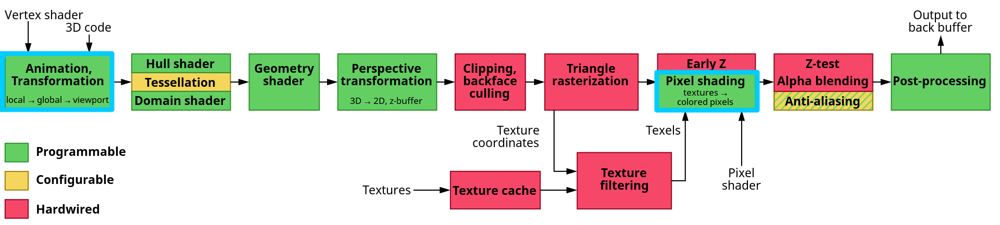
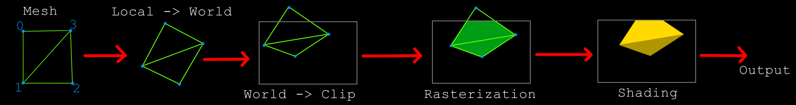

# Lesson 01

## 3D pipeline

[Wiki - Graphics pipeline](https://en.wikipedia.org/wiki/Graphics_pipeline)

## Shading

## Lighting

[Wiki - Lambertian reflectance](https://en.wikipedia.org/wiki/Lambertian_reflectance)